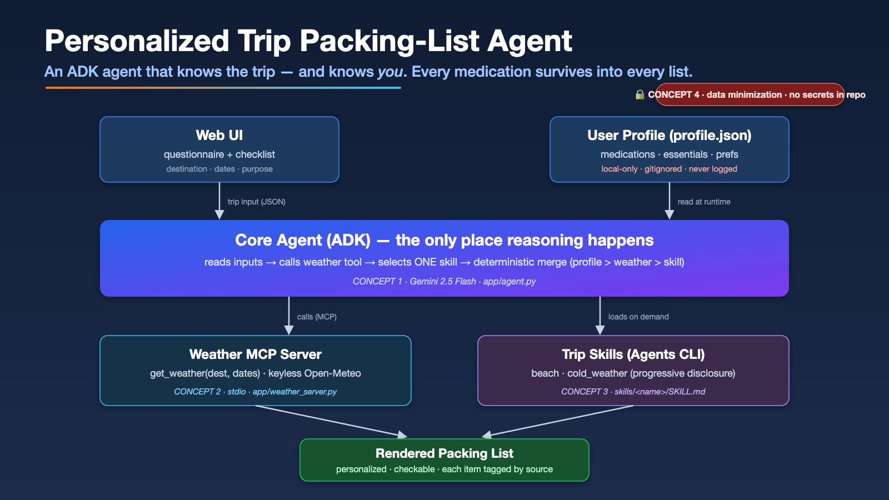
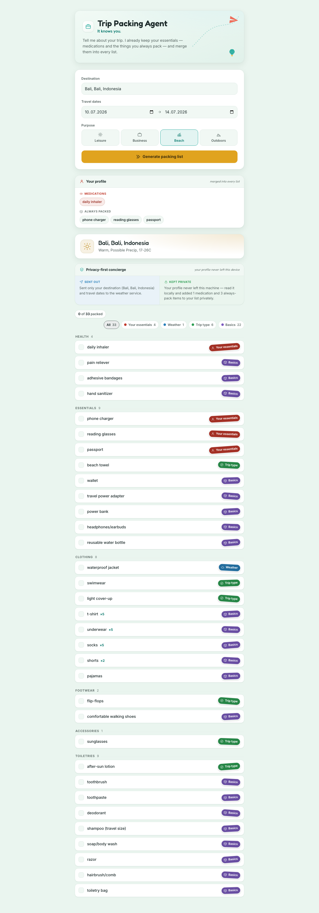
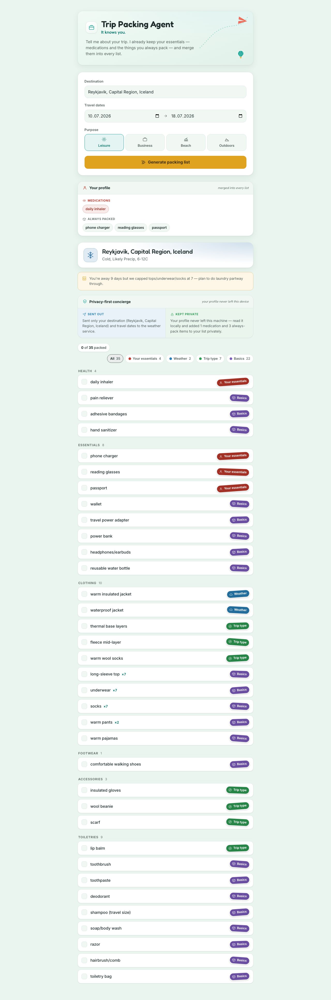

# Personalized Trip Packing-List Agent

> An AI **agent** that generates a personalized, trip-specific packing list by combining what it
> knows about the **trip** (destination, dates, purpose, live weather) with what it knows about
> **you** (medications, recurring essentials, preferences) — so you never forget the things
> generic lists miss.

**🔒 No API keys or secrets are committed to this repository.** The only secret (a Google AI
Studio key) lives in a gitignored `.env`, and the personal `profile.json` is gitignored too. See
[Privacy & security](#privacy--security).

Capstone for the Kaggle "AI Agents / Vibe Coding" course (Google-sponsored), **Concierge Agents**
track.

---

## The problem

Travellers forget the things generic checklists never know about: the **daily medication**, the
charger they always need, the rain layer the forecast quietly demands for *those specific dates in
that specific place*. A static template can't reason about any of it.

## The solution — "it knows you"

You fill a short web form (destination, dates, purpose). A stored **profile** holds your persistent
personal facts. The agent reads both, fetches the **live forecast**, picks the right **trip-archetype
skill**, and **merges** all three sources into a single checklist.

The headline value is **"it knows you"**: every medication and always-pack essential survives into
**every** list, regardless of trip type or weather — and we guarantee that *structurally*, not by
hoping the model remembers. That's the demo moment.

## Why an agent (and not a template)

The value requires *reasoning over multiple sources and orchestrating tools*: fetch live weather for
specific dates and place, choose the right domain knowledge (skill) for the trip type, and merge
that against persistent personal facts that must always be honored (e.g. medication) regardless of
trip. Deciding **what to call, when, and how to combine the results** is exactly what an agent does
and a template cannot.

---

## Architecture

Only the agent is "smart"; everything else is a tool or a data source it orchestrates.



**Request flow:** form (place picked from a disambiguating autocomplete) → agent →
`get_weather` (MCP, called with the picked lat/lon) → `select_skill` → `build_packing_list`
(four-source merge + quantity engine) → rendered §4.4 list.

Two real runs, same profile — the weather and quantities change, the medication never does:

| Warm trip (Bali, Indonesia) | Cold trip (Reykjavík, Iceland) |
|---|---|
|  |  |

### Components

| Component | Where | Responsibility |
|---|---|---|
| **Web UI** | `packing-agent/app/static/index.html` | Dumb client. Collects trip facts via a **disambiguating place autocomplete** (type → pick the exact city → its lat/lon ride along), shows a read-only **"Your profile" panel**, POSTs to `/generate`, and renders the returned list with per-item quantities. No business logic, no external calls. |
| **User profile** | `packing-agent/profile.json` (gitignored) | Persistent personal facts. Read by the **agent** at reasoning time — never by the UI, never sent to the weather tool, never logged. |
| **Core agent (ADK)** | `packing-agent/app/agent.py` | The orchestrator and the **only** place reasoning happens. Calls the weather tool, picks one skill, and runs the deterministic four-source merge — including the **base-essentials catalog + quantity engine** (universal items, per-day counts, weather-driven labels). |
| **Weather MCP server** | `packing-agent/app/weather_server.py` | A single tool `get_weather` over **stdio MCP**, backed by keyless **Open-Meteo**. Uses the picked lat/lon directly (skips re-geocoding); returns an honest `forecast_ok` flag instead of faking temperatures when a forecast can't be fetched. ADK spawns it as a subprocess — no extra terminal, no port. |
| **Trip skills** | `packing-agent/skills/{cold_weather,beach}/SKILL.md` | One folder per trip archetype: human guidance + a `## Packing items` list. Loaded **on demand** (progressive disclosure). |
| **Local web server** | `packing-agent/app/server.py` | GCP-free FastAPI entrypoint that drives the ADK agent. Also proxies `GET /geocode?q=` (Open-Meteo place search, so the UI never calls an external service) and `GET /profile` (read-only display data for the profile panel). |

---

## Course concepts demonstrated

| # | Concept | Where it lives |
|---|---|---|
| 1 | **Agent (ADK)** | `app/agent.py` — `root_agent` (Gemini 2.5 Flash) orchestrates three tools; all reasoning is here. |
| 2 | **MCP server** | `app/weather_server.py` — `get_weather` exposed via FastMCP over **stdio**, consumed through ADK's `McpToolset`. |
| 3 | **Agent Skills** | `skills/cold_weather/` and `skills/beach/`, selected on demand by the `select_skill` tool (progressive disclosure). |
| 4 | **Security / privacy** | Data minimization at the tool boundary, local-only gitignored profile, no secrets in repo, no PII in logs — see below. |

### The deterministic four-source merge + quantity engine (the agentic core)

`build_packing_list` in `app/agent.py` is where points are won. The LLM decides *to call it* and
hands over the trip + forecast, but the list itself is assembled by Python — never left to the model.

- Four sources are built separately: **profile** items (medications + always-pack), **weather**
  items (derived from the live forecast), **skill** items (from the chosen archetype), and **base**
  items (a universal essentials catalog + a quantity engine, so a list is never bare-bones).
- The **quantity engine** sizes the base layer to the trip: per-day items (tops, underwear, socks)
  are `min(days, 7)` with a "plan to do laundry" hint past the cap; bottoms and sleepwear get
  weather-driven labels (`shorts`/`pants`/`warm pants`, `pajamas`/`warm pajamas`). Each item carries
  a `quantity` the UI renders as `×N` (only when N > 1, so `passport` stays clean).
- They are merged by `_merge_by_precedence`, which dedupes by normalized label and keeps the
  **first** occurrence — so **precedence is encoded purely by order**.
- **Precedence: profile > weather > skill > base.** Medications occupy the **first** profile slot,
  so a medication is always the first occurrence of its label and can never be the copy a collision
  drops. **The meds-always guarantee is structural**, not an afterthought. Base is the generic floor:
  a `phone charger` the profile already owns dedupes the generic base copy away.

Each output item carries a `source ∈ {profile, weather, skill, base}` so the agent's reasoning stays
legible in the rendered list — colored badges (Your essentials / Weather / Trip type / Basics) make
it visible at a glance. When a live forecast can't be fetched, the list stays **honest**: a
`forecast_ok=false` flag drives a "packed a neutral baseline" note instead of inventing temperatures.

---

## Setup & run (from a clean clone)

**Prerequisites:** [`uv`](https://docs.astral.sh/uv/getting-started/installation/) (Python package
manager) and a free [Google AI Studio API key](https://aistudio.google.com/apikey).

```bash
# 1. Clone and enter the repo
git clone <repo-url> ai-travel-packing-agent
cd ai-travel-packing-agent

# 2. Create your local profile (gitignored personal data)
cp profile.example.json packing-agent/profile.json

# 3. Add your AI Studio key (gitignored secret)
cp .env.example packing-agent/app/.env
#    then edit packing-agent/app/.env and set GOOGLE_API_KEY=<your key>

# 4. Run the app (uv installs deps on first run; the MCP weather
#    server is auto-spawned — one command, no second terminal)
cd packing-agent
uv run python -m app.server
```

Open **http://127.0.0.1:8000**, start typing a destination, **pick the exact city from the
autocomplete** (this disambiguates e.g. *Bali, Indonesia* from a same-named village near Kolkata, and
sends its precise coordinates to the forecast), then click **Generate**.

**The money demo:** generate for a warm place (e.g. *Bali, Indonesia*) and then a cold one (e.g.
*Reykjavík, Iceland*) and watch the list transform with the live forecast — weather items, item
labels, and quantities all flip (`t-shirt ×5, shorts` ↔ `long-sleeve top ×7, warm pants ×2` + a
laundry hint) — while your medication and essentials persist, unmoved, on **every** list.

> **Free-tier quota caveat:** the AI Studio free tier has a per-day request cap (each Generate makes
> ~3 model calls). Heavy testing can exhaust it; the per-minute cap clears in ~1 min and the daily
> cap resets at midnight Pacific. **Before a live demo, enable billing on the AI Studio key**
> (pay-as-you-go; Flash is fractions of a cent per request) to remove the daily cap. The app maps a
> 429 to a clean, honest message in the UI instead of failing opaquely.

---

## Privacy & security

This is a Concierge agent handling personal and medical data, so the boundaries are deliberate:

1. **Data minimization at the tool boundary** — the weather tool receives **only** destination +
   dates. Profile, medications, and preferences never cross into any external request.
   (`app/weather_server.py` documents and enforces this.)
2. **No secrets in repo** — Open-Meteo is keyless. The only secret is the AI Studio key, which lives
   in a **gitignored** `.env`; `.env.example` ships only the variable names.
3. **No sensitive data in logs** — audited: the local demo path (`app/server.py` →
   `app/agent.py` → `app/weather_server.py`) emits **no logging at all**, so the profile and
   medications cannot leak through a log line. (The scaffold's separate Cloud Run entrypoint
   defaults prompt/response capture to `NO_CONTENT` and never logs the profile.)
4. **Local-only profile** — `profile.json` is gitignored, read locally by the agent only, and never
   uploaded or sent to third parties.
5. **"Vibe Diff" privacy summary** — every generated list ships with a plain-English `privacy_note`
   (derived in `build_packing_list`, shown on screen) stating exactly what crossed the tool boundary
   (destination + dates) versus what stayed local (medications + always-pack, named only by count so
   no medication name appears in the output text). Makes the privacy boundary legible, not implicit.

The read-only **"Your profile" panel** (served by `GET /profile`) surfaces your medication and
always-pack item *names* — but only in **your own local UI**. That is the deliberate inner boundary:
medication names are fine on your machine; the protected boundary is the **external** one, where the
weather tool still receives only a place and two dates.

---

## Project status

Built incrementally, kept runnable end-to-end at every step:

- ✅ **A — hardcoded spine:** form → ADK agent → rendered list, profile medication present.
- ✅ **B — real MCP weather:** `get_weather` over stdio MCP, backed by Open-Meteo; destination
  changes the forecast changes the list.
- ✅ **C — trip skills:** two contrasting skills with on-demand `select_skill` loading.
- ✅ **D — the merge:** deterministic four-source dedupe with the structural meds-always guarantee.
- ✅ **E — stretch:** on-screen "Vibe Diff" privacy summary, logging audit, checkbox UI with
  persisted state. (Cloud Run deployment is an optional bonus, not required for judging.)
- ✅ **Revamp polish:** disambiguating place autocomplete + lat/lon passthrough (kills the
  wrong-city forecast bug), honest `forecast_ok` failure flag, base-essentials catalog + quantity
  engine (four-source merge), and a read-only "Your profile" panel so "it knows you" is visible.

---

## Tech stack

ADK (agent orchestration) · MCP / FastMCP (weather tool, stdio transport) · Open-Meteo (keyless
weather) · skill folders with `SKILL.md` · FastAPI + a minimal static front end · `profile.json`
(JSON file store, single demo user) · `uv` for dependency management.
